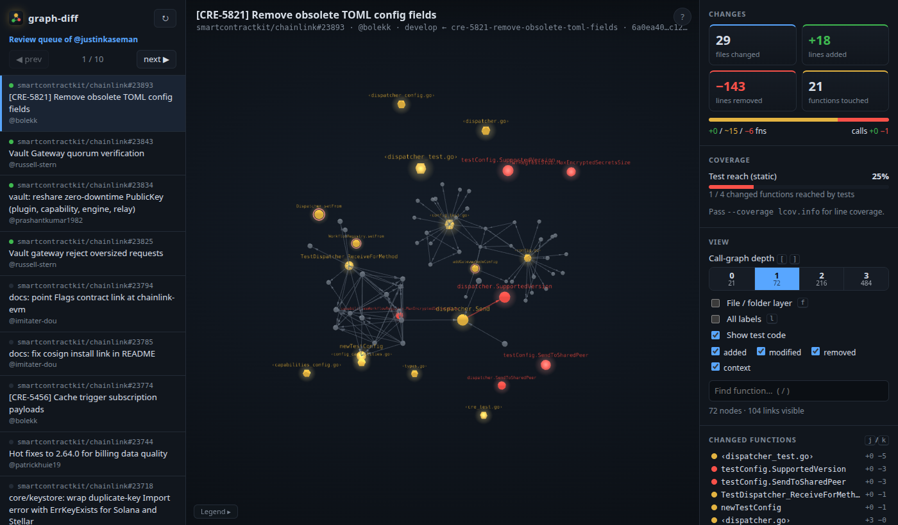

# graph-diff demo script

A 5-minute live demo built on real review queues of busy maintainers. There are two tracks: **chainlink**
(the main one) and **go-ethereum** (backup / second act). Reviewer numbers below were measured on 2026-10-05;
re-run `graph-diff reviewers …` before the demo, because queues change daily.



## Before the demo (10 min ahead)

1. **Install**: `git clone https://github.com/007vasy/graph-diff && cd graph-diff && npm ci && npm run build && npm link`
2. **chainlink only: authorize your `gh` token for `smartcontractkit` SSO** (github.com → Settings → Applications →
   GitHub CLI → *Configure SSO*, or open the link `gh` prints). Without it, graph-diff falls back to GitHub's
   **anonymous API: 60 requests/hour, about 1 per PR**, so a 10-PR queue uses ~11 per start. That's fine for one
   rehearsal and one live run, but not for repeated restarts.
3. **Pre-warm**: run the exact demo command once, press `n` through the queue, then quit. Commits are fetched and
   analyses are cached on disk, so the live run starts in seconds.
4. **Browser**: a large window, the graph-diff tab in front (Chrome pauses rendering in background tabs), and the legend
   open (it remembers its state).

## Track A: chainlink (main)

**Who's busiest right now**

```sh
graph-diff reviewers smartcontractkit/chainlink
```

| pending reviews | reviewer | demo command |
|---|---|---|
| 9 | justinkaseman | `graph-diff review --as justinkaseman --repo smartcontractkit/chainlink` |
| 8 | Tofel | `graph-diff review --as Tofel --repo smartcontractkit/chainlink` |
| 7 | bolekk | `graph-diff review --as bolekk --repo smartcontractkit/chainlink` |
| 7 | pavel-raykov | `graph-diff review --as pavel-raykov --repo smartcontractkit/chainlink` |
| 6 | kalverra | `graph-diff review --as kalverra --repo smartcontractkit/chainlink` |

**Script**

| # | Do | Say |
|---|---|---|
| 1 | `graph-diff reviewers smartcontractkit/chainlink` | "These are the people with the longest review queues in chainlink right now. Let's look at justinkaseman's." |
| 2 | `graph-diff review --as justinkaseman --repo smartcontractkit/chainlink` → pick the first PR | "That's his real queue: 10 open PRs waiting on him." |
| 3 | Point at the graph (#23893 *Remove obsolete TOML config fields*: 29 files, −143 lines) | "29 files in the GitHub diff, but in code it comes down to this: red = 6 deleted functions, amber = 15 touched. The rest is config." |
| 4 | Hover `dispatcher.Send` | "Hover shows that function's diff, nothing else. The red edge is a call this PR removes." |
| 5 | Right panel → **Test reach 25%** | "Only 1 of 4 changed functions is reached by any test. That's where I'd look first." Red rings mark the untested ones. |
| 6 | Click **2** in the depth buttons, then **1** | "Depth widens the blast radius: who calls this code, two hops out. The count on each button shows how big it gets." |
| 7 | Press `f` | "The file and folder layer shows where in the monorepo this lives." |
| 8 | Press `n` a few times | "Next PR is instant: the queue was pre-analysed while we talked. That's the point: cycle through a queue in minutes." |
| 9 | `j` / `k` | "Jump between changed functions without hunting through files." |

Good PRs to stop on, as a contrast to the removal-heavy #23893 (all from justinkaseman's queue):

| PR | what it shows |
|---|---|
| #23843 *Vault Gateway quorum verification* | big feature: 44 new functions, +107 call edges, test reach 12/22 (red rings) |
| #23834 *vault: reshare zero-downtime PublicKey* | 20 new / 28 changed functions across plugin, capability, engine and relay; try depth 2 |
| #23825 *Vault gateway reject oversized requests* | small and focused: 6 new functions, test reach 7/10 |

## Track B: go-ethereum (backup / second act)

No SSO or rate-limit concerns. go-ethereum has the biggest queues:

| pending reviews | reviewer |
|---|---|
| 69 | rjl493456442 |
| 52 | fjl |
| 28 | lightclient |

```sh
graph-diff review --as rjl493456442 --repo ethereum/go-ethereum
```

Stops worth showing: **#35864** (*eth/catalyst: resolve unknown forkchoice heads*: green call chain from new functions
into `forkchoiceUpdated`), **#35499** (large refactor: +19 / ~27 / −11 functions; use depth 0 → 1 → 2).

## Track C: the PR-side integration (30 s)

Open https://github.com/007vasy/go-ethereum/pull/1 → checks box → **graph-diff → Details** opens the same view, hosted
on GitHub Pages and produced by the Action on every push. Then scroll to the sticky comment (stats + untested functions).

## If something goes wrong

| Symptom | Fix |
|---|---|
| `GitHub REST 403` / rate limit on chainlink | authorize SSO (step 2), or switch to Track B |
| first PR slow (>10 s) | you skipped the pre-warm; talk through the stats panel while it loads |
| graph looks frozen | the tab was in the background; click into it, then press `z` (zoom to fit) |
| reviewer has 0 PRs | queues change; re-run `graph-diff reviewers` and take the next name |
